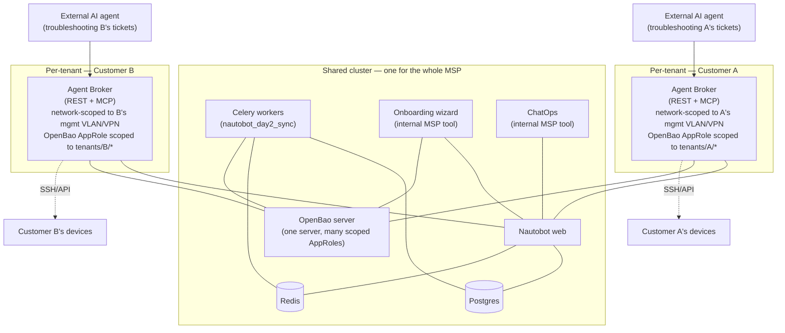
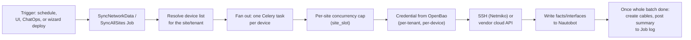
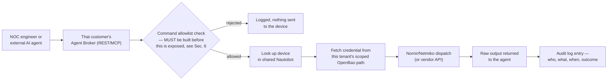

# Production Deployment Guide — nautobot_day2 for MSP NOC / Agentic Operations

This is the production topology and operational workflow reference for
running `nautobot_day2` at MSP scale, serving both human NOC engineers and
external AI agents. It assumes the single-server test setup
(`deploy/single-server/`) has already been proven out and this is the next
step: multiple customers, real devices, real credentials.

## 1. Architecture — shared core, per-tenant broker

**Why this shape**: the heavy, stateful services (Postgres, Redis, Nautobot,
Celery, OpenBao-the-server) are expensive to duplicate and don't need
duplicating — Nautobot's own tenant model and OpenBao's path-scoped
policies already provide isolation. The Agent Broker is cheap to duplicate
and *does* need duplicating — it's the one component that actually reaches
into a customer's live network, so it gets both a network boundary and a
credential-scope boundary per tenant.

## 2. Service placement

| Service | Placement | Isolation mechanism |
|---|---|---|
| Postgres | Shared | Nautobot's Tenant model + object permissions |
| Redis | Shared | N/A — pure infra for the shared tier |
| Nautobot web | Shared | Object-level permissions scoped by Tenant |
| Celery worker (`nautobot_day2_sync`) | Shared | Per-tenant credential resolution already built in; per-site concurrency cap |
| OpenBao server | Shared (one server) | Per-tenant AppRole + KV path policy (`tenants/<slug>/*`) |
| Onboarding wizard | Shared | Internal tool — MSP staff only, not customer-facing |
| ChatOps | Shared | Internal tool — MSP NOC team only |
| **Agent Broker (REST + MCP)** | **Per-tenant** | Network segmentation (mgmt VLAN/VPN) + scoped OpenBao AppRole |

## 3. Hardware / server layout

Minimum for a real production start (grows from here as customer count grows):

| Server | Role | Spec |
|---|---|---|
| Server 1 | Postgres + Redis (+ PgBouncer once worker count grows) | 8–16 vCPU, 32–64GB RAM, NVMe SSD |
| Server 2 | Nautobot web (+ LB in front once you add a 2nd web replica) | 4–8 vCPU, 8–16GB RAM |
| Server 3+ | Celery workers — `nautobot_day2_sync` | 4–8 vCPU, 8–16GB RAM each; add replicas as device count grows |
| Server N | OpenBao (dedicated — don't co-locate with app servers) | 4 vCPU, 8GB RAM, SSD; unsealed and backed up carefully |
| Per-tenant | Agent Broker instance(s) | Small — 1–2 vCPU, 2GB RAM is plenty; network-placed per customer, not sized for load |

## 4. Deployment steps

### 4.1 Shared core

1. Stand up Postgres and Redis (Section 1 of the earlier single-server walkthrough scales directly — same images, just on dedicated hosts, with `NAUTOBOT_DB_HOST`/`NAUTOBOT_REDIS_HOST` pointed at their real addresses).
2. Deploy Nautobot web + `pip install nautobot_day2` + `PLUGINS = ["nautobot_day2"]` in `nautobot_config.py`, pointed at the above.
3. Deploy Celery workers on their own host(s): `nautobot-server celery worker -Q nautobot_day2_sync --concurrency=10`. Add replicas as device count grows — no config change needed elsewhere.
4. Deploy OpenBao on its own dedicated host — **not** co-located with any app server. Enable TLS (the single-server compose file disables it for test convenience; production must not).
5. Deploy the onboarding wizard and ChatOps — both point at the shared Nautobot URL, both are internal-only (put them behind your own VPN/SSO, not public internet).

### 4.2 Per-tenant OpenBao policy (do this for every customer)

1. Create a KV v2 path namespace: `tenants/<customer-slug>/*`.
2. Create a dedicated AppRole for that customer's Agent Broker, with a policy that only permits `read` on `tenants/<customer-slug>/*` — nothing else, no wildcard across tenants.
3. Keep the separate write-scoped `day2-credential-refresher`-style AppRole (already in the codebase) restricted to the onboarding wizard's credential-save/rotation flow — the broker's AppRole should never have write access.

### 4.3 Per-tenant Agent Broker

1. Deploy one broker instance (REST + MCP) per customer, network-placed so it can only reach that customer's device management VLAN/VPN — not a shared network segment reaching every customer.
2. Configure it with that customer's scoped OpenBao AppRole (step 4.2) and point it at the shared Nautobot URL for device lookups.
3. **Do not expose this to any external agent until the allowlist + authentication gap is closed** (see Section 6) — this applies per-instance, it isn't solved by the network placement alone.

## 5. Operational workflows

### 5.1 New customer onboarding

```mermaid
flowchart LR
    A["MSP engineer opens\nonboarding wizard"] --> B["Step 1: Create tenant\n+ pick vendors"]
    B --> C["Step 2: Enter devices\n(table or CSV,\nstack/HA grouping)"]
    C --> D["Step 3: Validate\n(catch typos/dupes\nbefore Nautobot)"]
    D --> E["Step 4: Enter credentials\n(saved to OpenBao)"]
    E --> F["Step 5: Test credentials\n(real SSH/API check,\nreads from OpenBao)"]
    F --> G["Step 6: Deploy\n(creates devices,\ntriggers site sync\nvia real Job API)"]
    G --> H["Provision this customer's\nAgent Broker instance\n+ scoped OpenBao AppRole"]
    H --> I["Customer live —\nNOC/agents can now\ntroubleshoot via broker"]
```

### 5.2 Day-2 sync (scheduled or on-demand)

### 5.3 NOC / AI agent troubleshooting

### 5.4 Adding capacity (new worker, or a new customer)

- **More sync throughput**: add another Celery worker host pointed at the same shared Redis. No config change anywhere else.
- **New customer**: run Section 4.2–4.3 (OpenBao policy + a new broker instance) — nothing about the shared core changes.
- **Noisy-neighbor sync load**: if one customer's bulk sync starts crowding out others, that's the point to introduce priority queues (not built yet) rather than duplicating the whole worker tier.

## 6. Before this is safe for production/external-agent use — do not skip

1. **Agent Broker allowlist + authentication.** Confirmed still unbuilt as of the latest commit: no command allowlist, no auth on either the REST or MCP interface. This is the single highest-priority item — everything else in this guide assumes it exists.
2. **TLS everywhere it's currently disabled** — OpenBao's `tls_disable = true` in the single-server compose file is test-only.
3. **Per-tenant OpenBao AppRole scoping** (Section 4.2) — without this, even a correctly-authenticated broker request could still reach another tenant's secrets.
4. **Automated tests** — none exist yet anywhere in the repo. Given how much has been built (credential brokering, cable-creation race handling, multi-step wizard), this is real risk as more people touch the code in parallel without a regression safety net.
5. **Reconcile `onboard_cli.py`** — it still calls the old sequential sync path directly, separate from the Job/Celery pipeline everything else uses.

## 7. Status reference

See the main `README.md` for the up-to-date "what's verified vs. not yet
built" status — this guide describes the target production shape; the
README tracks what's actually true of the code at any given moment.
