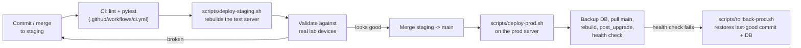

# Branch & Release Workflow

How a change actually gets from a developer's machine to the production
server. Two branches only — **there is no separate `prod` branch**:
`main` *is* production, because `scripts/deploy-prod.sh` pulls `main`
directly.



## The loop, step by step

1. **Work happens on `staging`.** Commit directly or merge a feature branch
   into it, then push. `ci.yml` runs `ruff` + `pytest` on every push to
   `staging`.
2. **Deploy to the test server:** `./scripts/deploy-staging.sh`. It pulls
   `staging`, rebuilds the Docker stack, and runs `post_upgrade`
   (migrations, Job registration).
3. **Validate against real lab devices.** The script prints its own
   checklist at the end — new feature works, existing vendors still
   onboard, existing sync jobs still run, the broker still responds. This
   is the human gate; nothing promotes automatically past it.
4. **Merge `staging` → `main`.** This also re-triggers CI (`ci.yml` runs on
   PRs targeting `main`). `main` is the production branch — there's no
   further promotion step.
5. **Deploy to the prod server:** `./scripts/deploy-prod.sh`. It backs up
   Postgres, records the current commit as a rollback point, pulls `main`,
   rebuilds, runs `post_upgrade`, then health-checks
   `http://localhost:8080/health/`.
6. **If something's wrong,** `./scripts/rollback-prod.sh <commit-file>
   <backup-sql-file>` restores the code and database to the recorded
   rollback point (paths are printed by `deploy-prod.sh` when it runs).

## Keeping the codebase graph current

This repo keeps a `graphify`-generated codebase graph under
`graphify-out/` (`graph.json`, `GRAPH_REPORT.md`, `graph.html`) as a
navigation aid — call graph, community structure, architectural hubs.
Whenever code on `staging` changes:

```bash
graphify extract "<repo path>" --code-only --force
graphify cluster-only "<repo path>" --no-label
```

Commit the refreshed `graphify-out/` files (everything except
`graphify-out/cache/`, which is gitignored build cache) alongside the code
change, on `staging`, same as any other file.

## What this workflow deliberately doesn't do

- No separate `prod` branch to keep in sync — one less thing to merge.
- No auto-deploy on merge to `main` — running `deploy-prod.sh` is always a
  deliberate, manual action.
- No skipping the test-server validation step — `main` should only ever
  receive changes that have already been run against real devices on
  `staging`.
