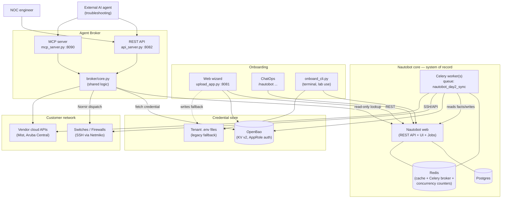
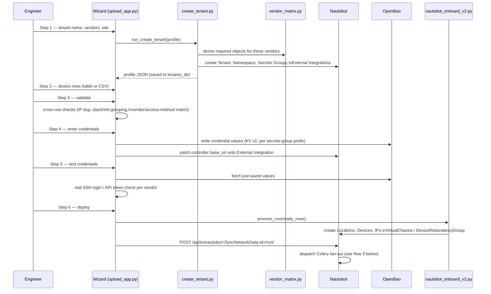
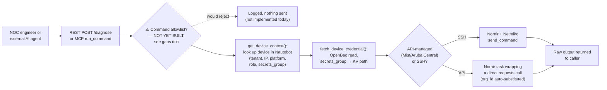
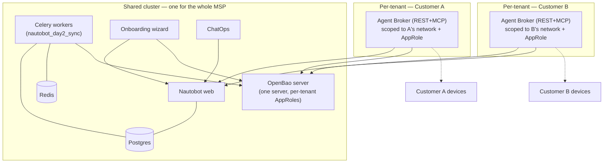

# Architecture — Flow Diagrams

Companion to `02-COMPONENTS.md` (what each piece does) and
`04-COMPONENT-PATHS.md` (where each piece lives). This doc shows how the
pieces connect and the order things happen in, for each of the three
distinct flows this codebase supports: **onboarding**, **day-2 sync**,
and **ad-hoc agent troubleshooting**.

---

## 1. System-level component map

**Key structural point**: the Agent Broker (`core.py`) and the sync engine
(`sync_network_data.py`) both resolve *device → vendor block → credential
→ dispatch* the same way, but they are triggered differently — the sync
engine runs on a schedule/Job trigger and writes results back to
Nautobot; the broker runs on-demand per request and returns raw output to
whoever asked. Neither one owns the other; `broker/core.py` imports
several resolver functions directly from `sync_network_data.py` to avoid
re-implementing vendor/credential resolution twice.

---

## 2. Onboarding flow (new customer or new site)

## 3. Day-2 sync flow (scheduled or on-demand)

```mermaid
flowchart LR
    A["Trigger:\nJobs UI / scheduler /\nChatOps / wizard deploy"] --> B["SyncNetworkData or\nSyncAllSites Job.run()"]
    B --> C["Resolve device list\n(get_devices_for_site)"]
    C --> D["group() — one\nsync_device_task\nper device"]
    D --> E{"Per-site\nconcurrency slot\navailable?\n(site_slot)"}
    E -- no --> R1["SiteAtCapacity —\nretry in 15s,\nup to 20x"]
    E -- yes --> F["Load tenant .env\n(fresh, overrides)"]
    F --> G["Fetch/resolve credential\nfrom OpenBao"]
    G --> H["resolve_vendor() →\nvendor_commands.yaml block"]
    H --> I{"SSH or API?"}
    I -- SSH --> J["Netmiko dispatch\n(ssh_get_data)"]
    I -- API --> K["Vendor cloud API\n(api_get_data)"]
    J --> L["Parse output →\nwrite_facts() to Nautobot"]
    K --> L
    L --> M{"Transient failure?\n(TIMEOUT/SSH_ERROR)"}
    M -- yes, retries left --> N2["retry with backoff\n15s * 2^n"]
    M -- no / terminal --> O["Return result dict\n(status, writes, neighbors)"]
    N2 --> F
    O --> P["chord callback:\nsync_summary_callback\n— runs once ALL\ndevice tasks in batch finish"]
    P --> Q["write_cables()\nfor every device's\nLLDP neighbors\n(batched — no race)"]
    Q --> S["One summary\nJobLogEntry on the\ndispatching Job's result"]
```

**Why the batched cable step matters**: cable creation depends on the
`lldp_hostname` custom field that `write_facts()` sets *per device*. If
cables were created inside `sync_device_task` itself (per device, as it
finishes), two devices that are each other's LLDP neighbor would only get
cabled if they happened to finish in a lucky order. Deferring it to the
chord callback — which only runs after every task in the batch has
completed — removes that race entirely.

## 4. Agent Broker flow (ad-hoc troubleshooting)

**Special case — Fortinet APs**: a real FortiAP has no independently
reachable SSH server (confirmed against real hardware — a genuine TCP
timeout). Both the sync engine and the broker redirect the connection
target to the AP's site's controlling FortiGate firewall's IP when the
resolved vendor block is `fortinet_ap_ssh`.

## 5. Per-tenant production topology

For a multi-customer MSP deployment, the shared/stateful core is **not**
duplicated per tenant, but the Agent Broker **is** — it's the one
component that actually reaches into a live customer network, so it gets
both a network boundary and a credential-scope boundary per tenant. Full
detail and rationale: `deploy/PRODUCTION_GUIDE.md` §1–§4 (which contains
the authoritative version of this diagram).

