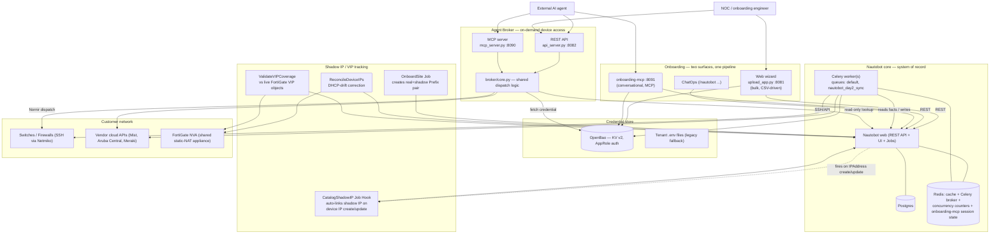
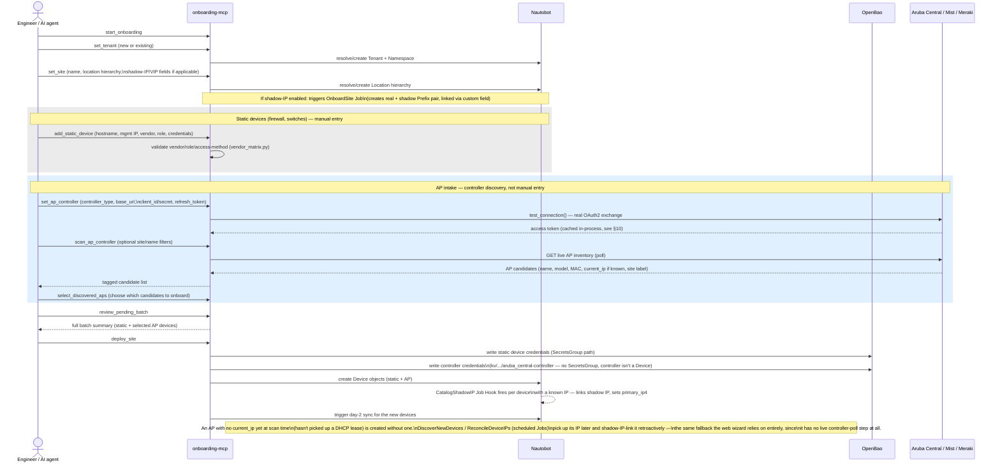

# Nautobot Day2 — Claude Project Context

**Purpose of this document**: a single, self-contained reference to attach
to a Claude Project so any future conversation about this codebase starts
with full context — no need to re-explain the architecture, the two
onboarding surfaces, the credential model, or the bugs/gotchas already
found and fixed. It synthesizes `docs/product/*` (the Confluence-bound
product doc set), the engineering docs (`docs/00`–`06`), and live-verified
findings from hands-on debugging sessions against the real lab
(`ubuntu@passbolt`) and Azure prod (`Nautobot@Nautobot-vm`) servers.

Repo: `itachiuch1haa/nautobot-day2-v2`. Primary dev branch: `staging`.
Production branch: `main`. Never push straight to `main` without an
explicit ask — the intended workflow is PR-gated promotion (see
[Branches & release workflow](#branches--release-workflow)).

---

## Table of contents

1. [What this platform is](#1-what-this-platform-is)
2. [System architecture](#2-system-architecture)
3. [The two onboarding surfaces](#3-the-two-onboarding-surfaces)
4. [Onboarding flow — full site with controller-managed APs](#4-onboarding-flow--full-site-with-controller-managed-aps)
5. [Day-2 sync engine](#5-day-2-sync-engine)
6. [Shadow IP / VIP tracking (NAT reconciliation)](#6-shadow-ip--vip-tracking-nat-reconciliation)
7. [Agent Broker](#7-agent-broker)
8. [Credential handling & OpenBao](#8-credential-handling--openbao)
9. [Glossary](#9-glossary)
10. [Known live-verified bugs & Nautobot-version gotchas](#10-known-live-verified-bugs--nautobot-version-gotchas)
11. [Security posture — what's open](#11-security-posture--whats-open)
12. [Deployment topology & servers](#12-deployment-topology--servers)
13. [Branches & release workflow](#13-branches--release-workflow)
14. [Roadmap](#14-roadmap)
15. [Where things live (file map)](#15-where-things-live-file-map)

---

## 1. What this platform is

Nautobot Day2 is an operations platform for MSPs running networks on
behalf of many customers, built as a Nautobot App (`nautobot_day2`) plus
several standalone services sharing its codebase and data model. It
answers four recurring MSP questions:

1. **Onboarding** — bring a new customer/site online in Nautobot correctly,
   without a spreadsheet and a prayer → web wizard + conversational MCP
   onboarding (`onboarding-mcp`).
2. **Drift detection** — keep Nautobot's record of the network in sync
   with what's actually running → the day-2 sync engine.
3. **Troubleshooting access** — let an engineer or an AI agent read/query
   a live device without handing out raw SSH credentials → the Agent
   Broker.
4. **NAT-aware addressing** — for MSPs where every customer sits behind a
   shared FortiGate doing static NAT to a shadow address space, track the
   real-IP ↔ shadow-IP mapping *in Nautobot*, not just in the firewall →
   shadow IP / VIP coverage tracking.

**Core design principle**: Nautobot is the single source of truth for
everything. No workflow maintains a second, competing copy of
tenant/site/device state — onboarding, sync, shadow-IP linking, and
troubleshooting are all thin, auditable layers that read and write
through Nautobot.

## 2. System architecture



Every write path funnels through Nautobot. The two onboarding surfaces
are two *interfaces* to the same underlying create/validate/deploy logic
— not two parallel pipelines that can drift apart (and where they briefly
did drift, e.g. the shadow-IP race condition, that was treated as a bug
and unified — see §10).

## 3. The two onboarding surfaces

| | Web wizard | `onboarding-mcp` |
|---|---|---|
| Interface | Flask web UI, port 8081 | MCP tools, port 8091 |
| Interaction style | Bulk — CSV upload, one site per run | Conversational — one device/site at a time |
| Best for | Preparing a whole site's device list in a spreadsheet ahead of time | An engineer or AI agent working interactively, or discovering AP inventory live from a controller |
| Underlying code | `onboarding/upload_app.py` (UI) → `nautobot_onboard_v2.py` (deploy logic) | `onboarding_mcp/tools_schema.py` (MCP tool implementations) → shares `nautobot_onboard_v2.py`'s `link_shadow_ip_sync()` and `create_tenant.py`'s secrets-group derivation |
| Controller-managed AP intake | Rows entered manually with IP + "managed by" field, same as any other device | Live discovery: `set_ap_controller` → `scan_ap_controller` (polls the real controller API) → `select_discovered_aps` |
| Status | GA | GA — brought to full parity with the wizard this cycle after several real bugs found and fixed (§10) |

Both surfaces produce the exact same end state in Nautobot: a Device with
a resolved SecretsGroup, a primary IP (shadow IP if the site has
shadow-IP tracking enabled), and (once synced) live facts.

## 4. Onboarding flow — full site with controller-managed APs

This is the flow for onboarding a whole site (firewall + switches +
APs managed by a cloud controller) via `onboarding-mcp`. The key point:
**APs are discovered by polling the live controller's API, not entered
row-by-row with a known IP** the way static devices (and the web
wizard's CSV rows) are.



**Takeaway for future conversations**: if the question is "how do APs
under a cloud controller get their IP into Nautobot," the answer depends
on *when*: known at discovery time → handled inline during `deploy_site`;
not yet known (no DHCP lease yet) → picked up later by the scheduled
`DiscoverNewDevices`/`ReconcileDeviceIPs` jobs. The web wizard has no
live-poll step at all — it relies entirely on the scheduled-job fallback
for controller-managed devices.

## 5. Day-2 sync engine

A Nautobot Job (`SyncNetworkData` for one site, `SyncAllSites` for
everything) resolves the device list, then fans out one Celery task per
device, respecting a per-site Redis-backed concurrency limit. Each task:
fetches the device's credential from OpenBao → dispatches SSH (Netmiko)
or a vendor cloud API call → parses the response → writes facts (serial,
firmware, interfaces, LLDP-derived neighbors) back to Nautobot. After
every task in a batch finishes, one callback creates LLDP-derived cables
in a single pass (deliberately deferred to avoid two mutually-neighboring
devices racing on which creates the cable first).

Transient failures (timeout, SSH error) retry with backoff; terminal
failures (auth failure) do not. Juniper Mist has an independent
SSoT-style sync path (`MistSyncJob`) that pulls directly from Mist's
cloud API. **`SIMULATED` dry-run mode does not actually prevent live
dispatch today** — treat every sync run as live (see §10/§11).

## 6. Shadow IP / VIP tracking (NAT reconciliation)

For customers whose devices sit behind a shared FortiGate NVA doing
offset-preserving static NAT (the Nth host in a real `/24` maps to the
Nth host in the shadow `/24` — pure arithmetic, not a lookup table:
`shadow_ip/shadow_math.py`, independently unit-tested):

- **`OnboardSite`** creates the real prefix and its shadow-prefix pair
  together at site-onboarding time, linked via a custom field
  (`nat_shadow_prefix`).
- **`CatalogShadowIP`** (a Job Hook, not an explicit Job) fires
  automatically the instant any real device `IPAddress` is created or
  updated in Nautobot. It computes the device's shadow IP, creates/links
  the shadow `IPAddress` record, and points `device.primary_ip4` at the
  shadow address — so every downstream consumer (sync engine, Agent
  Broker, a human in the Nautobot UI) reaches the device through an
  address that's actually routable.
- **`ReconcileDeviceIPs`** (scheduled) catches DHCP-lease drift — a
  device's real IP changing — and re-derives its shadow IP to match.
- **`DiscoverNewDevices`** (scheduled) picks up controller-managed
  devices (APs) that get an IP *after* onboarding rather than at
  onboarding time.
- **`ValidateVIPCoverage`** (scheduled) compares Nautobot's shadow-prefix
  records against the FortiGate NVA's actual VIP objects, flagging
  mismatches — needs live FortiGate reachability (`FORTIGATE_NVA_BASE_URL`/
  `FORTIGATE_NVA_API_TOKEN`); silently skips otherwise. **Not yet
  validated against a real FortiGate NVA** (open item, §10).

Both onboarding surfaces trigger this identically — it's not
wizard-specific or `onboarding-mcp`-specific logic.

## 7. Agent Broker

On-demand, credential-brokered access to a live device, for a human
engineer or an AI agent, via REST (`api_server.py`, port 8082) or MCP
(`mcp_server.py`, port 8090) — both call the same shared logic in
`broker/core.py`: resolve the device in Nautobot → resolve its
SecretsGroup → fetch the credential from OpenBao → dispatch via Nornir
(Netmiko for SSH-managed vendors, a direct API call for cloud-managed
ones) → return raw output.

`GET /device/<name>` returns Nautobot-sourced metadata with no live
device contact. `POST /diagnose` (REST) / `run_command` (MCP) dispatches
a real command. **Neither interface has authentication or a command
allowlist today** — this is the platform's top-priority open security
item (§11). Controller-only device types (e.g. Fortinet APs, which have
no independently reachable SSH server) are automatically redirected to
their controlling FortiGate by both the sync engine and the broker.

## 8. Credential handling & OpenBao

**OpenBao** (Linux Foundation fork of HashiCorp Vault, chosen specifically
to avoid Vault's post-fork BSL license) is the credential store every
live component reads from. KV v2, path convention:
`kv/data/tenants/<tenant-slug>/<secrets-group-prefix>`.

- **AppRole auth**: `role_id` (safe to hardcode) + `secret_id` (kept in
  `.env`, gitignored). Three pinned identities exist:
  - `day2-sync-engine` — read-only, used by the sync engine, broker, and
    the wizard's live-credential-test step.
  - `day2-credential-refresher` — write-scoped, used only for
    credential save/rotation. Never the same identity as the read path.
  - (a third pinned AppRole for whatever else needs it — see
    `deploy/single-server/INSTALL.md` for the exact set on the current
    stack).
- **Legacy `.env` fallback**: still dual-written alongside OpenBao for
  every credential save, but no live component reads it as authoritative
  anymore — a documented, not-yet-closed gap (§11).
- **Root token / unseal key**: the unseal key decrypts storage on every
  restart (an administrative control, not a login credential); the root
  token is break-glass, unrestricted admin access — normally used only
  during initial bootstrap. **Live-verified finding this cycle: this
  build's `generate-root`/`rotate-keys` recovery ceremony returns
  `permission denied` even fully unauthenticated — the designed
  break-glass path does not work.** Practical fallback if the root token
  is lost was wiping the (empty, at the time) data volume; once real
  tenant secrets exist this would mean losing every credential OpenBao
  holds. **Operational rule: never revoke the root token as routine
  hygiene; always keep at least one valid privileged token stored
  securely off-box for the life of every OpenBao instance.**

### Aruba Central: two separate, disconnected credential conventions

Important gotcha for anyone touching Aruba Central code — there are
**two unrelated storage paths that never sync with each other**:

| | Path | Key style | Used by |
|---|---|---|---|
| (a) | `kv/data/tenants/<slug>/aruba_central-controller` | plain keys: `base_url`, `client_id`, `client_secret`, `refresh_token` | `onboarding-mcp`'s controller-management flow (`aruba_central_client.py`) |
| (b) | `kv/data/tenants/<slug>/aruba-central-api` | env-var-style keys: `ARUBA_CLIENT_ID_<SUFFIX>` etc. | The wizard / sync engine / Agent Broker, via `sync_network_data.py::resolve_creds()` |

A device onboarded through the wizard (`controller_managed: False` in
this codebase's own custom-field sense, even if Nautobot's *native*
Controller relationship shows it as controller-managed) has its Aruba
credentials in path (b) only — fixing path (a)'s token-rotation bug (§10)
does nothing for it. Don't assume "fixed for Aruba Central" without
checking which path a given device's credentials actually live in.

**Aruba Central OAuth2 refresh-token grant rotates the refresh token on
every single exchange** — the response's `refresh_token` field is always
new, and the previous one is immediately invalidated. Any client that
discards it (rather than detecting the change and persisting it) breaks
on the very next call. Both credential paths' client code now correctly
detect and persist rotation; `onboarding-mcp`'s path additionally caches
the resulting access token in a module-level, per-process, per-tenant
dict (`_ARUBA_TOKEN_CACHE`) so repeated MCP tool calls within the token's
~30-minute lifetime reuse it instead of re-exchanging (and re-rotating)
on every call — valid because `onboarding-mcp`'s `server.py` runs as one
long-lived process for the container's lifetime, mirroring the pattern
`sync_network_data.py` already used for the wizard/sync-engine path.

## 9. Glossary

- **Tenant** — a Nautobot object representing one customer.
- **Namespace** — Nautobot's IPAM container; one per tenant, so two
  customers can both use `10.0.0.0/8` without colliding.
- **Location hierarchy** — Region → Country → State → City → Site, built
  consistently regardless of onboarding surface.
- **Secrets Group** — names *which* credential a device uses; the value
  lives in OpenBao, not in Nautobot.
- **External Integration** — Nautobot's model for "managed through a
  third-party controller" (Mist, Aruba Central, Meraki).
- **Job vs. Job Hook** — a Job is explicitly triggered (UI/schedule/API);
  a Job Hook fires automatically on a model change (e.g. `CatalogShadowIP`
  on `IPAddress` create/update).
- **Real IP/prefix vs. shadow IP/prefix** — the customer's actual device
  address vs. the shared, routable address the MSP side actually uses to
  reach it, related by offset-preserving static NAT on a shared FortiGate
  NVA.
- **VIP (Virtual IP)** — FortiOS's term for a static-NAT mapping object;
  `ValidateVIPCoverage` compares this against Nautobot's own record.
- **Tenant profile** — a JSON document per tenant recording which
  vendors/device-types/access-methods it uses; drives which SecretsGroups
  and External Integrations get created.
- **Ready CSV** — the normalized device-data shape
  (`nautobot_ready_<site>.csv`) `nautobot_onboard_v2.py` actually consumes.
- **Static vs. controller-managed device** — fixed management IP entered
  directly, vs. discovered through a controller's own API (often without
  a known IP until later).
- **Idempotent** — safe to re-run against already-onboarded state without
  erroring or duplicating objects; a design property maintained throughout
  this codebase's onboarding paths.
- **AppRole / KV v2** — OpenBao's machine auth method / versioned
  secrets engine, respectively.
- **`vendor_matrix.py`** — single source of truth mapping vendor +
  device-type + access-method to Nautobot platform, NAPALM driver, env
  vars, and secrets-group prefix.
- **`vendor_commands.yaml`** — actual SSH command strings / API endpoint
  paths per vendor+platform; adding a vendor's commands is a data change,
  not a code change.
- **Nornir** — the network-automation framework the Agent Broker uses to
  dispatch commands.

## 10. Known live-verified bugs & Nautobot-version gotchas

These are already fixed, but worth knowing about because they reveal
real quirks of this specific Nautobot version that could bite future
code touching the same surface area:

- **`PrefixQuerySet` has no `net_overlap`** on this version — use
  `net_contains_or_equals`/`net_contained_or_equal` instead.
- **`Prefix`/`IPAddress.status` is required with no default.**
- **`custom_field_data` is a Python property, not a real Django field** —
  `_custom_field_data` is the actual field name for filtering; it cannot
  be set via `get_or_create()`'s `defaults=` at all.
- **A custom field's `key` (not `name`) is its real identifier.**
- **`IPAddress` has no public `namespace` attribute** on this version —
  only reachable via `.parent.namespace`. (This exact bug was hit in
  `shadow_ip/jobs/catalog_shadow_ip.py`: `real_ip.namespace.name` had to
  become `real_ip.parent.namespace.name`.)
- **A REST API `Prefix`'s nested `namespace` reference has no `name`
  field** — only `{id, url, object_type}`; code comparing by name instead
  of id silently gets `None`.
- **`JobHookReceiver.receive_job_hook()`'s real signature** on this
  version takes `change` (not `change_context`); `snapshots` needs a
  default since Nautobot doesn't always pass it.
- **The CatalogShadowIP race condition** (found and fixed twice — once in
  `onboarding-mcp`, then live on a real customer tenant deployed via the
  **web wizard**): the Job Hook fires the instant a real IP is created,
  asynchronously via Celery, *before* the onboarding code's own follow-up
  REST calls (interface link, `primary_ip4` patch) even start — so the
  hook's device lookup finds nothing regardless of call ordering. Not
  fixable by forcing strict ordering (not reliably controllable across an
  async Job Hook and a synchronous REST caller); fixed instead by making
  the onboarding code's own follow-up idempotent against the hook's
  independent attempt. Both surfaces now share one implementation,
  `nautobot_onboard_v2.link_shadow_ip_sync()` — no more separate copies
  that can drift.
- **`SIMULATED` dry-run mode doesn't prevent live dispatch** for any
  currently-supported vendor/platform — confirmed via a real SSH
  connection attempt against an unreachable test IP. Treat every sync run
  as live.
- **Async sync Jobs' `JobResult.status` never updates past `Pending`** —
  confirmed deployment-wide (even a plain synchronous `OnboardSite` Job
  shows this), not specific to this codebase. `job_log_entries` *are*
  reliably persisted; both onboarding surfaces poll those instead.
- **This Nautobot version has no `object`/multi-object custom field
  type** — all shadow-IP/VIP custom fields store a UUID as plain text.
  Functionally fine since every read/write here goes through the ORM
  directly, not REST serialization; only the built-in clickable-reference
  UI is lost.
- **OpenBao's `generate-root`/`rotate-keys` recovery ceremony returns
  `permission denied`** on this build/version, even fully unauthenticated
  — see §8 for the operational rule this drove.
- **Aruba Central refresh-token rotation** — see §8's dedicated section.

## 11. Security posture — what's open

Nothing here is hidden — every item was found and documented by the team
building the platform, not by an outside reviewer.

**Priority 1 — block before any exposure beyond a trusted internal
network:**
- The Agent Broker (8082/8090) and `onboarding-mcp` (8091) have **no
  authentication and no command allowlist**. Any caller that can reach
  them can run any command — including destructive ones — against any
  resolvable device, using a real, live-fetched credential.
  `onboarding-mcp` is arguably higher-risk: it **writes new credentials
  into OpenBao and creates real Nautobot objects**, not just reads and
  runs commands with an existing one. Current mitigation is network
  boundary only (these ports aren't opened beyond the deployment box's
  trusted network) — not an application-level control.

**Priority 2 — before real customer credentials are stored long-term:**
- Per-tenant credential isolation is a documented design intent (each
  tenant's Agent Broker scoped to its own read-only AppRole), not an
  enforced control — nothing today would catch a misconfigured AppRole
  reading a different tenant's secrets.
- TLS is disabled by default in the single-server reference deployment
  (explicitly test-only in the compose file) — confirm end-to-end TLS
  before any real customer traffic.
- OpenBao's recovery-path gap (§8) — keep a privileged token off-box,
  always.

**Priority 3 — process/hygiene, not blocking correctness today:**
- No automated test suite (except the shadow-IP math's pure-Python
  units).
- Credential rotation is manual/per-field, no automated cadence.
- Legacy `.env` files are still dual-written alongside OpenBao.
- No documented backup/DR strategy for Postgres, OpenBao, or tenant
  profile JSONs.

**What's already solid**: real read/write AppRole separation in OpenBao
(never the same identity for both), credentials never hardcoded or
committed, genuine live credential testing before deploy (not just a
syntax check), and per-tenant Agent Broker network isolation in the
documented multi-server production topology (once its manual scoping
step is actually followed).

## 12. Deployment topology & servers

- **Single-server** (`deploy/single-server/`) — one Docker Compose stack:
  Postgres, Redis, OpenBao, Nautobot web + worker, the wizard, both Agent
  Broker interfaces, `onboarding-mcp`. This is what backs both real
  servers in active use for this project:
  - **Lab**: `ubuntu@passbolt` — used for live validation/testing against
    real Aruba Central-managed APs and the Agent Broker.
  - **Azure prod**: `Nautobot@Nautobot-vm` — fresh install this cycle;
    OpenBao fully re-initialized and rotated with no values ever exposed
    in the final pass.
- **Multi-server production** (`deploy/PRODUCTION_GUIDE.md`, documented
  but not what's currently running) — shared stateful core MSP-wide;
  Agent Broker deployed **per tenant** for network + credential isolation.

## 13. Branches & release workflow

- **`staging`** — primary development branch; CI runs on every push.
- **`main`** — production branch; promoted from `staging` after human
  validation against real lab devices.
- The intended promotion gate is a **PR from `staging` into `main`
  requiring review approval** (GitHub branch protection under
  `Settings → Branches` on `main`: require a pull request before merging,
  require at least one approval, no direct pushes). This must be
  configured via the GitHub web UI — no API/MCP tool sets branch
  protection rules in this environment. **Status: instructions given to
  the user; not yet confirmed configured.** Until confirmed, do not push
  directly to `main` — always stop and ask, or open a PR instead.
- Historical fast-forward pattern used before the approval gate was
  requested: `git checkout main && git merge --ff-only origin/staging &&
  git push origin main:main`. **Do not do this unprompted going
  forward** — the user wants to personally approve every staging→main
  promotion.

## 14. Roadmap

Vision: Nautobot as the complete, single source of truth for every
customer's network — queryable, reportable, change-tracked, and
eventually interactively editable, reached equally well through chat, an
MCP client, or the Nautobot UI. Five themes, explicitly sequenced behind
one hard gate:

| Theme | Extends | Status |
|---|---|---|
| A. Complete system of record | Core positioning | Ongoing — close remaining gaps (vendor coverage, dual-write retirement, live FortiGate validation) |
| B. Command execution abstraction | Agent Broker | Exists — needs the Priority 1 security gate closed before hardening further |
| C. Searchable inventory & customer reporting via chat/MCP | ChatOps + new read-only MCP tools | Not started — depends on the gate |
| D. Config change history & per-customer approval workflow | Day-2 sync engine | Not started — depends on the gate |
| E. Interactive inventory management via MCP (edit/delete) | `onboarding-mcp` (today: add-only) | Not started — depends on the gate; explicitly named as higher-risk than B given no auth today |

**Hard gate**: Themes C, D, and E all expand blast radius (more surfaces
that can read *or change* a customer's entire network). All three depend
on Priority 1 of §11 (auth + command allowlist on the Agent Broker and
`onboarding-mcp`) being closed **first**, not developed in parallel.
`docs/product/07-ROADMAP.md` carries the Now/Next/Later breakdown
(currently template placeholders awaiting prioritization).

## 15. Where things live (file map)

```
nautobot_day2/                     # the installable Nautobot App
├── shadow_ip/                     # shadow-IP/VIP module
│   ├── shadow_math.py             # offset-preserving NAT arithmetic (unit-tested)
│   └── jobs/
│       └── catalog_shadow_ip.py   # CatalogShadowIP Job Hook
├── onboarding/                    # web wizard's backend logic
│   ├── upload_app.py              # Flask app, port 8081
│   ├── nautobot_onboard_v2.py     # CSV → Nautobot deploy logic, incl. link_shadow_ip_sync()
│   ├── create_tenant.py           # tenant profile → SecretsGroups/ExternalIntegrations
│   ├── sync_network_data.py       # day-2 sync engine, incl. Aruba token cache (reference impl)
│   ├── vendor_matrix.py           # vendor/device-type/access-method source of truth
│   └── openbao_client.py          # update_rotated_credential() etc.
├── onboarding_mcp/                # conversational onboarding surface
│   ├── server.py                  # long-lived MCP server process, port 8091
│   ├── tools_schema.py            # MCP tool implementations (set_tenant, set_site, set_ap_controller, ...)
│   ├── controllers/
│   │   ├── base.py                # APControllerClient interface
│   │   ├── aruba_central_client.py
│   │   ├── mist_client.py
│   │   └── meraki_client.py
│   └── deploy/
│       ├── nautobot_deployer.py   # deploy_device(), calls shared link_shadow_ip_sync()
│       └── credential_writer.py   # writes static-device + controller credentials
├── broker/
│   ├── core.py                    # shared Agent Broker dispatch logic
│   ├── api_server.py              # REST interface, port 8082
│   └── mcp_server.py              # MCP interface, port 8090
└── chatops/
    └── worker.py                  # Slack /nautobot commands

docs/
├── 00-WORKFLOW.md .. 06-GAPS-AND-RECOMMENDATIONS.md   # engineering docs (deep detail)
├── product/                       # Confluence-bound product doc set (stakeholder-level)
│   ├── 01-PRODUCT-OVERVIEW.md .. 07-ROADMAP.md
└── CLAUDE-PROJECT-CONTEXT.md      # this document

deploy/
├── single-server/INSTALL.md       # 18-phase fresh-install walkthrough (Docker Compose)
└── PRODUCTION_GUIDE.md            # documented multi-server production topology
```

---

*This document is a synthesis, not a replacement, for the underlying
docs it draws from. For exact API signatures, file line numbers, or the
full technical detail behind any item summarized here, consult
`docs/06-GAPS-AND-RECOMMENDATIONS.md` (engineering-depth) or the specific
`docs/product/*` page named inline above.*
