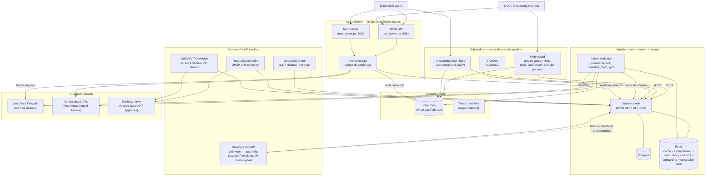

# Architecture

This page gives the system-level view: what the major subsystems are, how
they connect, and the shape of each core flow. For exact file paths,
ports, env vars, and deep implementation detail, see the engineering docs
(`docs/02-COMPONENTS.md`, `docs/03-ARCHITECTURE.md`, `docs/04-COMPONENT-PATHS.md`)
— this page is deliberately one level higher-altitude, updated to include
the two additions from this development cycle (`onboarding-mcp` and the
`shadow_ip` module) that the engineering diagrams predate.

## System-level component map

**Key structural point**: every write path — onboarding, sync, shadow-IP
linking, ad-hoc troubleshooting — goes through Nautobot as the single
source of truth. Nothing maintains a second, independent copy of
tenant/site/device state. The two onboarding surfaces (web wizard and
`onboarding-mcp`) are two different *interfaces* to the same underlying
create/validate/deploy logic, not two separate pipelines.

## The four core flows

### 1. Onboarding (new customer or new site)

Either surface — web wizard or `onboarding-mcp` — walks through the same
logical stages: resolve or create the tenant → resolve or create the
site (including, optionally, its real+shadow IP prefix pair) → collect
and validate device data → write credentials to OpenBao → deploy devices
into Nautobot → trigger the day-2 sync engine against the newly created
devices. The web wizard does this in bulk from an uploaded CSV, one site
per run; `onboarding-mcp` does it conversationally, one device at a time,
suited to an AI agent or an engineer working interactively rather than
preparing a spreadsheet.

### 2. Day-2 sync (scheduled or on-demand)

A Nautobot Job (`SyncNetworkData` or `SyncAllSites`) resolves the device
list for a site or tenant, then fans out one Celery task per device
(respecting a per-site concurrency limit so a large sync doesn't
overwhelm one customer's network). Each task fetches the device's
credential from OpenBao, dispatches SSH or a vendor cloud API call,
parses the response, and writes facts (serial, firmware, interfaces,
LLDP-derived neighbors) back to Nautobot. Once every task in a batch
finishes, a single callback creates any LLDP-derived cables in one pass —
deliberately deferred so two devices that are each other's neighbor don't
race on which one gets cabled first.

### 3. Shadow IP / VIP tracking (real-to-shadow NAT reconciliation)

For customers whose devices sit behind a shared FortiGate NVA doing
static, offset-preserving NAT, `OnboardSite` creates a real prefix and
its corresponding shadow prefix together, mapped via a custom field.
From then on, a Job Hook (`CatalogShadowIP`) fires automatically every
time a real device IP is created or updated, computes that device's
shadow IP, and points `device.primary_ip4` at the shadow address — so
every downstream consumer (sync engine, Agent Broker, a human clicking
into the device in Nautobot's UI) reaches the device through the address
that's actually routable, without needing to know about the NAT layer at
all. `ReconcileDeviceIPs` and `ValidateVIPCoverage` run on a schedule to
catch drift (a device's DHCP lease changing, or the firewall's VIP object
diverging from what Nautobot thinks it should be).

### 4. Ad-hoc troubleshooting (Agent Broker)

A human or an AI agent asks a question about one device — "what does
this device's interface config look like," "run this diagnostic
command" — through either the REST or MCP interface. Both call the exact
same shared logic: look the device up in Nautobot, resolve its secrets
group, fetch the credential from OpenBao, dispatch the command via
Nornir, and return raw output. Neither interface currently enforces a
command allowlist or authentication — see `05-SECURITY-AND-COMPLIANCE.md`.

## Deployment topology

Two documented shapes:

- **Single-server** (`deploy/single-server/`) — everything in one Docker
  Compose stack: Postgres, Redis, OpenBao, Nautobot web + worker, the
  wizard, both Agent Broker interfaces, and `onboarding-mcp`. This is
  what backs the staging/test server and, currently, the fresh Azure
  prod install described in this cycle's work.
- **Multi-server production** (`deploy/PRODUCTION_GUIDE.md`) — the
  shared, stateful core (Postgres, Redis, Nautobot, Celery workers,
  OpenBao, the wizard, ChatOps) runs once for the whole MSP; the Agent
  Broker is deployed **per tenant**, each instance scoped to that
  tenant's network reachability and its own OpenBao AppRole — because
  it's the one component that actually reaches into a live customer
  network, it's the one that gets both a network boundary and a
  credential-scope boundary per customer.

## What changed this cycle

Two additions since the engineering architecture doc was last fully
updated, both now live-verified end to end:

1. **`onboarding-mcp`** — a second onboarding surface, conversational
   rather than bulk/CSV, exposing the same underlying create-tenant /
   create-site / deploy-device logic as MCP tools instead of wizard
   steps. Brought to functional parity with the web wizard this cycle.
2. **`shadow_ip` module** — the real-to-shadow IP mapping and VIP
   coverage tracking described in flow 3 above. New Nautobot Jobs
   (`OnboardSite`, `CatalogShadowIP`, `ReconcileDeviceIPs`,
   `DiscoverNewDevices`, `ValidateVIPCoverage`), new custom fields, and a
   new Job Hook, all wired into both onboarding surfaces.
